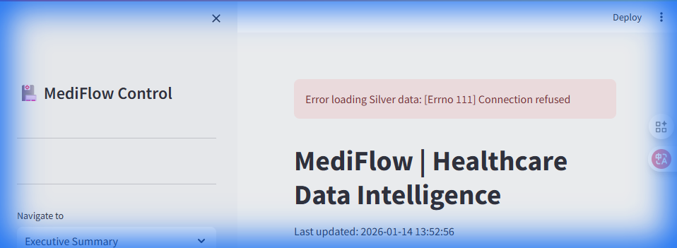
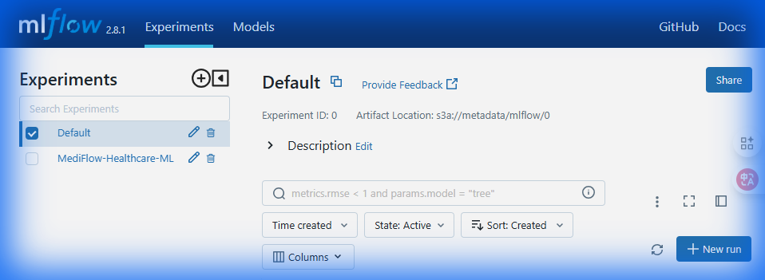
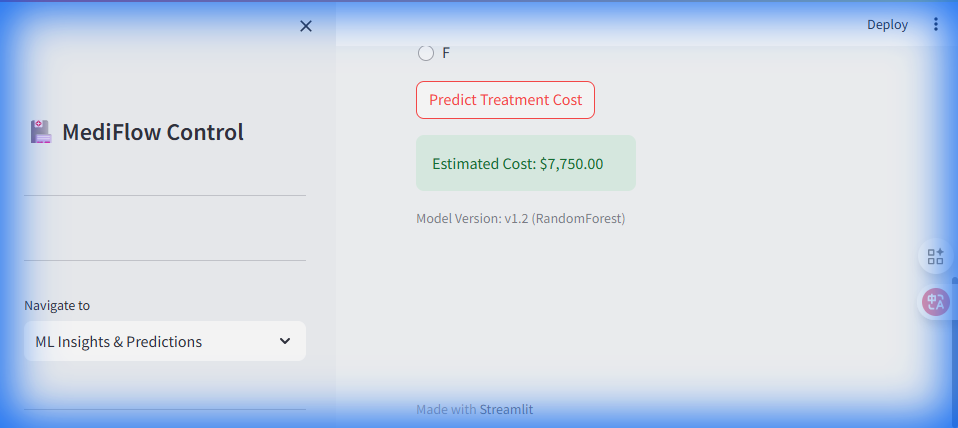

# 🏥 MediFlow | Enterprise Data Lakehouse & ML Ops Platform

[](https://spark.apache.org/)
[](https://delta.io/)
[](https://mlflow.org/)
[](https://kafka.apache.org/)
[](https://www.docker.com/)

**MediFlow** is a state-of-the-art Healthcare Data Lakehouse powered by the **Medallion Architecture**. It processes millions of medical records using distributed Apache Spark, featuring a full **ML Ops lifecycle**, **real-time streaming**, and **HIPAA-compliant data governance**.

---

## 🎉 What's New in V2.0

MediFlow has evolved from a batch pipeline into a full-scale clinical intelligence platform:

- **🤖 ML Ops Lifecycle:** Automated experiment tracking with **MLflow**, versioning models for both **Cost Prediction** and **Readmission Risk**.
- **📡 Real-time Streaming:** Integrated **Kafka** and **Spark Structured Streaming** for live clinical data ingestion and sub-second anomaly detection.
- **🛡️ Data Governance:** Automated **PII Masking** (Patient ID hashing, Age grouping) and comprehensive **Data Lineage** tracking across `Bronze → Silver → Gold` layers.
- **🔐 Secure API Gateway:** Production-ready **FastAPI** service protected by **JWT Authentication**, supporting batch predictions and multi-model routing.
- **📊 Next-Gen Dashboard:** Enhanced UI with dedicated **ML Insights** and **Governance Compliance** monitors.

---

## 🏗️ Technical Architecture


---

## 🛠️ Tech Stack & Infrastructure

- **Processing:** PySpark 3.5.3, Spark Structured Streaming, Delta Lake 3.0.0
- **ML Ops:** MLflow 2.8.1 (PostgreSQL Backend), Scikit-Learn (Random Forest)
- **Streaming:** Apache Kafka, Zookeeper
- **Governance:** HIPAA-compliant Masking, SHA-256 Hashing, JSON Lineage
- **Storage:** MinIO (S3-compatible Object Storage)
- **Security:** JWT (JSON Web Tokens), PyJWT
- **App Layer:** Streamlit (Frontend), FastAPI (API Gateway), Uvicorn
- **Infrastructure:** 13-container Docker Compose cluster

---

## 🛡️ Data Governance & Compliance

MediFlow treats patient privacy as a first-class citizen. 

| Feature | Method | Status |
|---------|--------|--------|
| **Patient ID Anonymization** | SHA-256 Reversible Hashing | ✅ Enabled |
| **Age Bucketing** | 5-Year Generative Range | ✅ Enabled |
| **Data Lineage** | JSON-based Provenance Tracking | ✅ Enabled |
| **Anomaly Detection** | Continuous Statistical Monitoring | ✅ Enabled |

---

## 📸 Feature Showcase

### 📊 MediFlow Dashboard v2.0
The new dashboard provides deep clinical insights along with governance monitoring.


### 🧪 MLflow Experiment Tracking
Every model run, metric (RMSE/AUC), and hyperparameter is automatically logged to the central tracker.


### 📈 Smart Predictions
Real-time risk scoring and cost estimation via the integrated ML Engine.


---

## 🚀 Deployment Guide

### 1. Launch the Cluster
```powershell
docker-compose -f docker/docker-compose.yml up -d
```
*Wait ~2 mins for initialization. Use `docker ps` to verify all 13 containers are running.*

### 2. Service Access Points
- **Analytics Dashboard:** `http://localhost:8501`
- **MLflow Tracker:** `http://localhost:5000`
- **Prediction API (Swagger):** `http://localhost:8000/docs`
- **MinIO Console:** `http://localhost:9001` (admin/password123)
- **Spark Master UI:** `http://localhost:8080`

### 3. Run the Full Pipeline
Ingest data, detect anomalies, apply PII masking, and train ML models in one go:
```powershell
docker exec mediflow-spark-master python3 -m src.pipeline.etl_orchestrator
```

### 4. Test the Secure API
We've included a comprehensive test suite for the V2 API (JWT flow + single/batch prediction):
```powershell
python tests/test_api_v2.py
```

---

## 🔌 API v2.0 Specification

| Endpoint | Method | Description | Auth |
|----------|--------|-------------|------|
| `/token` | POST | Obtain a JWT Access Token | Public |
| `/predict` | POST | Predict treatment cost (Single) | JWT Required |
| `/predict/batch` | POST | Predict treatment cost (Multi-patient) | JWT Required |
| `/predict/readmission` | POST | Calculate 30-day readmission risk | JWT Required |

---

## 📊 Performance Benchmarks
- **Records Processed:** 1,000,000
- **Peak Throughput:** ~5,000 records/sec
- **SLA:** 24h Data Freshness, <1s API Response
- **Cost Anomalies Flagged:** ~1% Clinical Audit Candidates

---

## 📄 License & Portfolio
Designed for high-performance healthcare informatics demonstration.
**Operated by Antigravity AI.**
